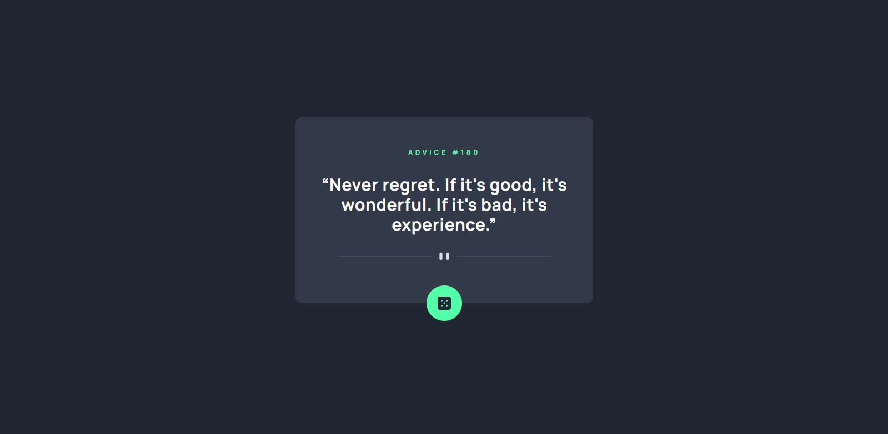
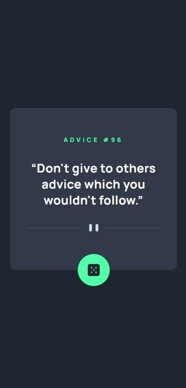

# Frontend Mentor - Advice generator app solution

This is a solution to the [Advice generator app challenge on Frontend Mentor](https://www.frontendmentor.io/challenges/advice-generator-app-QdUG-13db). Frontend Mentor challenges help you improve your coding skills by building realistic projects.

## Table of contents

- [Overview](#overview)
  - [The challenge](#the-challenge)
  - [Screenshot](#screenshot)
  - [Links](#links)
- [My process](#my-process)
  - [Built with](#built-with)
  - [What I learned](#what-i-learned)
  - [Useful resources](#useful-resources)

## Overview

### The challenge

Users should be able to:

- View the optimal layout for the app depending on their device's screen size
- See hover states for all interactive elements on the page
- Generate a new piece of advice by clicking the dice icon

### Screenshot

### Links

- Solution URL: [Frontend Mentor](https://your-solution-url.com)
- Live Site URL: [Vercel](https://your-live-site-url.com)

## My process

### Built with

- Semantic HTML5 markup
- CSS custom properties
- Flexbox
- CSS Grid
- Mobile-first workflow
- TypeScript
- [Axios](https://axios-http.com/docs/intro)
- [React Query](https://tanstack.com/query/v3/)
- [React](https://reactjs.org/) - JS library
- [Next.js](https://nextjs.org/) - React framework
- [Tailwind CSS](https://tailwindcss.com/) - For styles

### What I learned

Using React Query with the new App routing system in Next.js 13.4 and TypeScript.

### Useful resources

- [Next.js icon meta data](https://nextjs.org/docs/app/api-reference/file-conventions/metadata/app-icons#image-files-ico-jpg-png) - For setting up app icon in Next.js
- [Deep Dive Into Next.js 13 Data Fetching](https://dev.to/zenstack/a-deep-dive-into-next13-data-fetching-114n)
- [How to Setup React Query in Next.js 13 App Directory](https://codevoweb.com/setup-react-query-in-nextjs-13-app-directory/) - This helps me with data fetching in the new Next.js routing system
